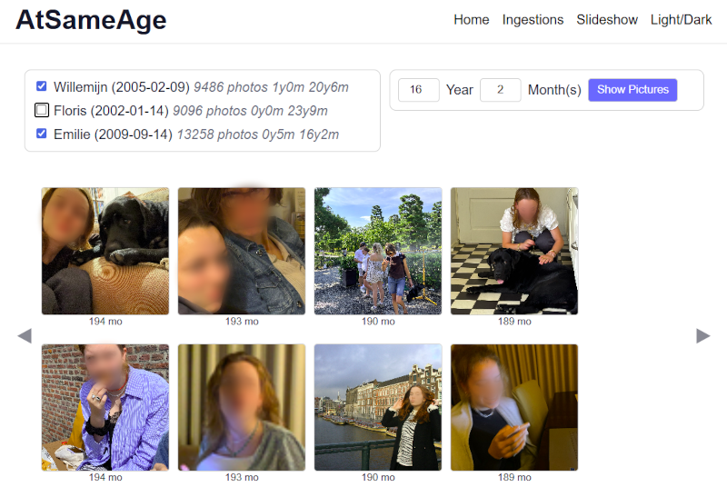
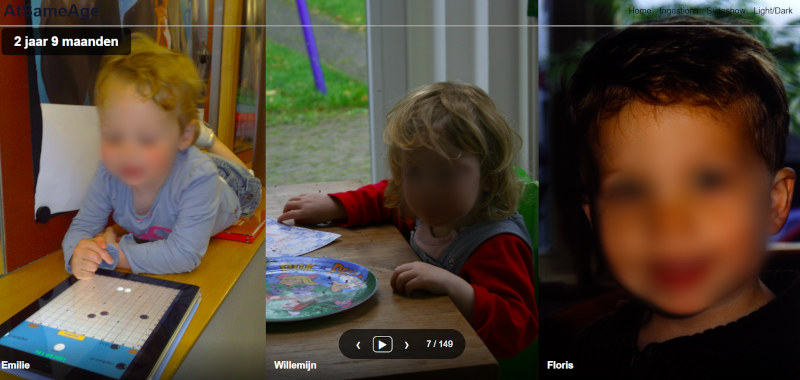
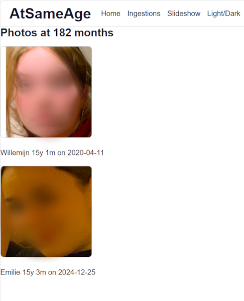

# AtSameAge

A photo slideshow application that displays photos from your Immich instance of people who were the same age when their photos were taken.

## Overview

AtSameAge connects to your Immich instance and retrieves photos of people who have their birth dates registered. It then displays photos of different people who were the same age at the time the photo was taken, creating an interesting comparison across time and generations.

## Features

- 🔗 Connect to your Immich instance
- 📅 Automatic age calculation based on registered birth dates
- 🖼️ Photo slideshow of people at the same age
- 👥 Compare photos across different people and time periods
- ⚙️ Configurable slideshow interval and transition effects
- 🔄 Manual and automatic photo syncing via Celery tasks
- 🎯 Easy-to-use interface

## Prerequisites

- Docker and Docker Compose
- An [Immich](https://immich.app/) instance with API access
- People in your Immich instance with birth dates configured

## Screenshots
. 
. 
. 


## Installation

### 1. Clone the repository
```bash
git clone https://github.com/thekampany/atsameage.git
cd atsameage
```

### 2. Configure environment variables

Create a `.env` file from the sample:
```bash
cp .env.sample .env
```

**Required settings:**
```env
# Immich Connection
IMMICH_API_URL=https://your-immich-instance.com/api
IMMICH_API_KEY=your-api-key-here

# Django Settings
SECRET_KEY=your-secret-key-here
DEBUG=1

# Network Access
# Add your local IP if accessing from other devices on your network
ALLOWED_HOSTS=localhost,127.0.0.1,192.168.x.x

# CORS (frontend access)
CORS_ALLOWED_ORIGINS=http://localhost:3000,http://192.168.x.x:3013

# Database
POSTGRES_DB=atsameage
POSTGRES_USER=atsameage
POSTGRES_PASSWORD=your-password-here

# Redis (for Celery)
CELERY_BROKER_URL=redis://redis:6379/0
CELERY_RESULT_BACKEND=redis://redis:6379/0
```

### 3. Update Docker Compose

In `docker-compose.yml`, update the frontend API URL to match your setup:
```yaml
frontend:
  environment:
    - REACT_APP_API_URL=http://localhost:8018/api  # Change to your IP if needed
```

**Note:** If accessing from other devices, use your machine's IP address (e.g., `http://192.168.x.x:8018/api`)

### 4. Build and run
```bash
docker compose build
docker compose up -d
```

### 5. Access the application

Open your browser and visit:
- Frontend: http://localhost:3000
- Backend API: http://localhost:8018/api

## Getting Started

### First Time Setup

1. **Navigate to Ingestions** page in the application
2. **Run the sync task manually** to import people and photos from Immich
3. **Go back to the main page** to see your photos grouped by age
4. **Start the slideshow!**

### Automatic Syncing

The app includes a scheduled task that runs daily at 3 AM to sync new photos. You can modify this schedule in the Django admin or via the Tasks page.

## How It Works

1. **Data Collection**: Periodically queries your Immich instance for people with birth dates
2. **Age Calculation**: For each photo, calculates how old the person was when the photo was taken: api/search/metadata.fileCreatedAt vs api/people.birthDate
3. **Matching**: Groups photos by age across different people
4. **Display**: Shows photos in a slideshow format, highlighting the common age

## Architecture

- **Frontend**: React application (port 3000)
- **Backend**: Django REST API (port 8018)
- **Task Queue**: Celery with Redis
- **Database**: PostgreSQL
- **Photo Source**: Immich API

## Troubleshooting

### "No people found" message
- Make sure you've run the sync task from the Tasks page
- Verify your Immich API credentials in `.env`
- Check that people in Immich have birth dates configured

### CORS errors
- Ensure `CORS_ALLOWED_ORIGINS` in `.env` includes your frontend URL
- Restart the backend after changing CORS settings: `docker-compose restart web`

### Can't access from another device
- Add your machine's IP to `ALLOWED_HOSTS` in `.env`
- Update `REACT_APP_API_URL` in `docker-compose.yml` to use your IP instead of localhost
- Restart containers: `docker-compose restart`


## Contributing

Contributions are welcome! Please feel free to submit a Pull Request.


## Privacy Note

This application accesses personal information (birth dates and photos) from your Immich instance. Ensure you have appropriate permissions and comply with privacy regulations when using this tool. All data is stored locally in your Docker environment.

## License

This project is licensed under the MIT License - see the [LICENSE](LICENSE) file for details.

## Acknowledgments

- Built for use with [Immich](https://immich.app/)
- Inspired by the joy of comparing life moments across time

## Support

If you encounter any issues or have questions:
- Open an issue on [GitHub](https://github.com/thekampany/atsameage/issues)

---

**Made with ❤️ for comparing family moments across generations**